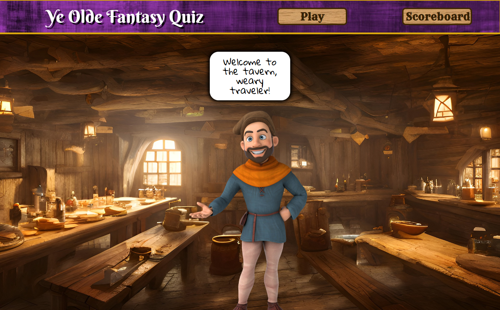

# Javascript Quiz!
[Link to the Web App](https://ds055.github.io/js-quiz/)

## Description
Users can play a quiz game over popular fantasy novels. At the end of the game, they can keep track of their high scores locally. 

## Screenshot

## Installation
N/A

## Usage
* Users will arrive at the website--perhaps discovered via a search engine.
* Users may select to play the game via the "Play" button or view the high scores page with the "High Scores" button.
* After clicking "Play," users will be presented with a series of 10 questions based on popular fantasy titles. 
* Answers will be displayed below the questions. 
* Users can gain 10 seconds by clicking on the correct answer, but an incorrect answer will deduct 5 seconds.
* A game over occurs if users either run out of time or if all questions are answered. 
* Upon a game over, users will see their score (timer) and be able to input their initials. 
* By clicking submit, a local copy of their scores is saved to their machine, and they are redirected to the high scores page. 
* Otherwise, users may forego submitting a score and simply play again by clicking the "Play" button once more. 

## License
Please refer to the license in the repo.

- - -

### Special Notes

- Tavern image from Pixabay, [which can be found here](https://pixabay.com/illustrations/tavern-pub-architecture-restaurant-7793824/), using the Pixabay Licencse.

- Peasant image from Pixabay, [which can be found here](https://pixabay.com/illustrations/medieval-3d-cartoon-man-boy-7267880/), using the Pixabay Licencse.

- Sound Effects are used from <a href="https://pixabay.com/?utm_source=link-attribution&amp;utm_medium=referral&amp;utm_campaign=music&amp;utm_content=19107">Pixabay</a>

- In-Game Music retrieved from:
One Bard Band by Alexander Nakarada | https://www.serpentsoundstudios.com
Music promoted by https://www.free-stock-music.com
Creative Commons / Attribution 4.0 International (CC BY 4.0)
https://creativecommons.org/licenses/by/4.0/

- High Score Screen Music retrieved from:
Tavern Loop One by Alexander Nakarada | https://www.serpentsoundstudios.com
Music promoted by https://www.free-stock-music.com
Creative Commons / Attribution 4.0 International (CC BY 4.0)
https://creativecommons.org/licenses/by/4.0/